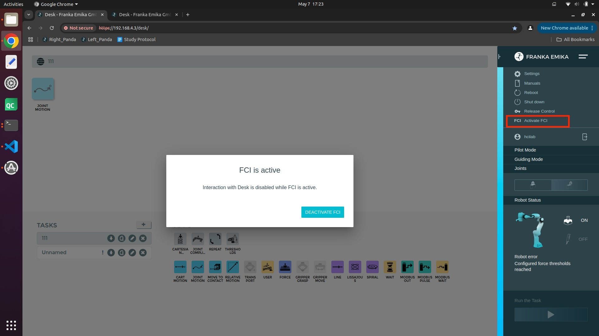
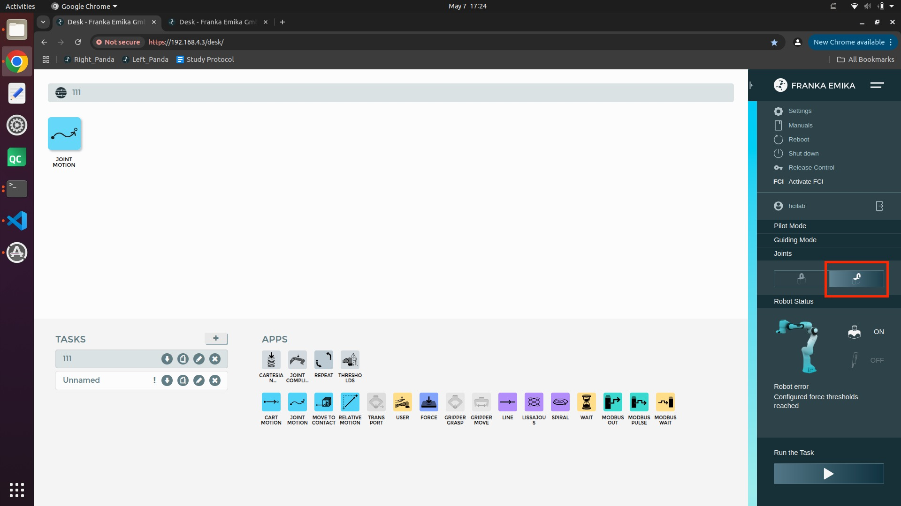
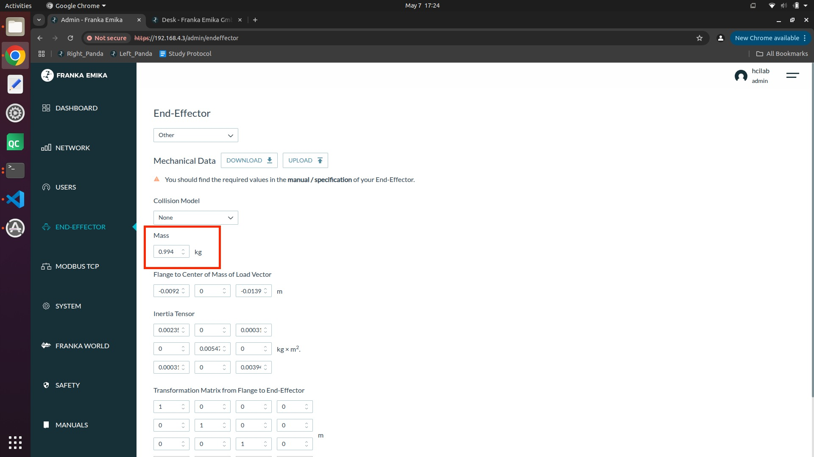
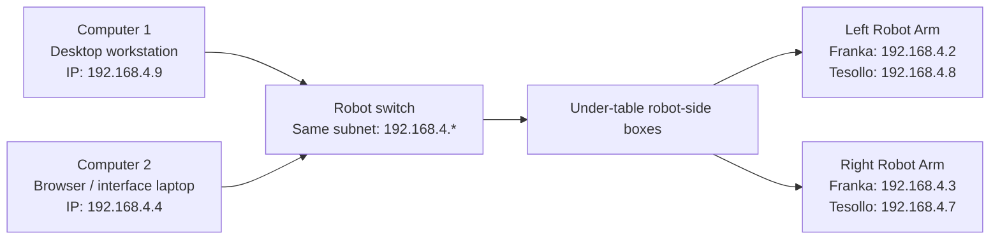

# Bimanual Panda Setup

This document explains how to set up the lab's bimanual Franka Panda robot system from scratch.

The setup includes:

- powering on both robot arms
- checking the Ethernet network configuration
- verifying ROS-related IP settings
- opening the Franka Desk web interface
- unlocking the robot arms
- activating FCI for code control
- checking end-effector settings when needed
- understanding emergency stop buttons
- understanding the network relationship between computers, robot arms, switches, and grippers

---

## 1. System Overview

The lab setup includes two robot arms, two main computers, robot-side network hardware, and grippers.

### Main computers

- **Computer 1**: desktop workstation / left workstation
- **Computer 2**: right-side laptop used to open the Franka Desk web interface in a browser

### Network subnet

The system uses the following subnet:

```text
192.168.4.*
```

Both computers and robot devices must be on this same subnet.

The first three parts of the IP address must stay the same:

```text
192.168.4
```

The last number can be different, but it must be unique and must match the corresponding values used in the ROS / Docker scripts.

---

## 2. Power On the Robot System

### 2.1 Turn on the main switches

There are two black switches on the table legs. Turn on both switches.

### 2.2 Turn on the floor boxes

There are two transparent boxes on the floor. Turn on both boxes.

### 2.3 If the robot does not respond

If the power is on but the robot does not react:

1. Turn the system off.
2. Wait for 15 minutes.
3. Turn the system on again.

### 2.4 Check the robot light

If the robot light is yellow, the robot is ready to use the interface.

After the interface setup is completed correctly, the robot light should become blue.

---

## 3. Computer 2 Network Setup

Computer 2 is the laptop used to open the robot web interface.

### 3.1 Open the network settings

Go to:

```text
Settings → Network → Wired → gear icon → IPv4
```

### 3.2 Required IPv4 settings

Set the robot-facing wired connection as follows:

```text
IPv4 Method: Manual
Address: 192.168.4.4
Netmask: 255.255.255.0
Gateway: leave blank
DNS: Automatic ON
```

The other IPv4 methods should not be selected:

```text
Automatic (DHCP): not selected
Shared to other computers: not selected
Link-Local Only: not selected
Disable: not selected
```

### 3.3 Important note

The example configuration uses:

```text
192.168.4.4
```

The first three parts must stay the same:

```text
192.168.4
```

The last number does not have to be exactly `4`, but if it is changed, the corresponding ROS / Docker script values must also be updated.

---

## 4. Computer 1 Network Setup

Computer 1 is the desktop workstation.

### 4.1 Open the network settings

Go to:

```text
Settings → Network
```

Use the robot-facing Ethernet connection. In the current setup, this is the USB Ethernet connection.

Then open:

```text
USB Ethernet → gear icon → IPv4
```

### 4.2 Required IPv4 settings

Set the robot-facing Ethernet connection as follows:

```text
IPv4 Method: Manual
Address: 192.168.4.9
Netmask: 255.255.255.0
Gateway: leave blank
DNS: Automatic ON
Routes: Automatic ON
```

The other IPv4 methods should not be selected:

```text
Automatic (DHCP): not selected
Shared to other computers: not selected
Link-Local Only: not selected
Disable: not selected
```

### 4.3 Important note

The example configuration uses:

```text
192.168.4.9
```

The first three parts must stay the same:

```text
192.168.4
```

The last number can be changed if needed, but if it is changed, the corresponding ROS / Docker script values must also be updated.

---

## 5. Check ROS / Docker Script Files on Computer 1

On Computer 1, open the repository in VS Code.

Repository root:

```text
dexterity-interface
```

The relevant files are inside:

```text
scripts/
```

The important files are:

```text
scripts/docker_control.sh
scripts/docker_isaac.sh
```

The main thing to check is whether the IP addresses in these files match the actual network settings of Computer 1 and Computer 2.

---

## 6. `scripts/docker_control.sh`

### 6.1 File location

```text
scripts/docker_control.sh
```

### 6.2 Purpose

This script is for the control / ros-base side.

### 6.3 Content

```bash
#!/bin/bash

# Run inside the ros-base container.
# Builds ROS packages
set -e

export ROS_STATIC_PEERS=192.168.4.9
export ROS_AUTOMATIC_DISCOVERY_RANGE=SUBNET

cd /workspace/libs/robot_motion_interface/ros
colcon build --cmake-clean-cache --symlink-install

cd /workspace/libs/primitives/ros
colcon build --cmake-clean-cache --symlink-install

cd /workspace
source libs/robot_motion_interface/ros/install/setup.bash
source libs/primitives/ros/install/setup.bash

exec bash
```

### 6.4 What to check

Check this line carefully:

```bash
export ROS_STATIC_PEERS=192.168.4.9
```

The address `192.168.4.9` corresponds to Computer 1, the desktop workstation.

If the IP address of Computer 1 changes, this value must be updated.

---

## 7. `scripts/docker_isaac.sh`

### 7.1 File location

```text
scripts/docker_isaac.sh
```

### 7.2 Purpose

This script is for the isaac-base container.

### 7.3 Content

```bash
#!/bin/bash

# Run inside the isaac-base container (Terminal 1).
# Builds ROS packages.

export ROS_STATIC_PEERS=192.168.4.4
export ROS_AUTOMATIC_DISCOVERY_RANGE=SUBNET

cd /workspace/libs/robot_motion_interface/ros
colcon build --cmake-clean-cache --symlink-install

cd /workspace/libs/primitives/ros
colcon build --cmake-clean-cache --symlink-install

cd /workspace

source libs/robot_motion_interface/ros/install/setup.bash
source libs/primitives/ros/install/setup.bash
```

### 7.4 What to check

Check this line carefully:

```bash
export ROS_STATIC_PEERS=192.168.4.4
```

The address `192.168.4.4` corresponds to Computer 2, the browser / interface laptop.

If the IP address of Computer 2 changes, this value must be updated.

---

## 8. Important IP Consistency Check

The most important thing is to make sure the IP addresses in the network settings and the script files are consistent.

### Current mapping

```text
Computer 1 / desktop:
Network address: 192.168.4.9
Related script: scripts/docker_control.sh
Related line: export ROS_STATIC_PEERS=192.168.4.9

Computer 2 / browser laptop:
Network address: 192.168.4.4
Related script: scripts/docker_isaac.sh
Related line: export ROS_STATIC_PEERS=192.168.4.4
```

If one of the computer IP addresses changes, update the corresponding script file.

---

## 9. Open the Franka Desk Interface

The robot interface can be opened through the robot network URL.

Example:

```text
https://192.168.4.3/desk/
```

There are also browser bookmarks for the robot interfaces, so in normal use you can open the interface directly from the saved shortcut.

Common bookmarks include:

```text
Right_Panda
Left_Panda
```

---

## 10. Activate FCI for Code Control

Use **Activate FCI** when the robot needs to be controlled through code.



After FCI is active, the interface may show:

```text
FCI is active
Interaction with Desk is disabled while FCI is active.
```

This means code control is enabled.

If you need to manually use Desk again, deactivate FCI first.

---

## 11. Unlock the Robot Joints

In the right-side control menu, find the **Joints** section.

Click the unlock button on the right side of the Joints row.



This unlocks the robot joints and allows the robot to be moved or controlled.

The lock control is one of the most commonly used buttons in the interface.

---

## 12. End-Effector Settings

Sometimes the end-effector setting needs to be checked or updated.

Go to:

```text
Settings → End-Effector
```

The mass value is especially important when the hardware configuration changes.



In the current setup, the end-effector page includes a mass setting such as:

```text
Mass: 0.994 kg
```

Only modify this setting when the end-effector or robot hardware configuration changes.

This is especially important if:

- a new robot is added
- a new gripper is installed
- the end-effector changes
- the mass parameter needs to be updated

Do not change the end-effector parameters unless you know the correct mechanical values.

---

## 13. Expected Robot Status

After the network, script, interface, and unlock settings are correct:

```text
Robot light: blue
Robot status: ready or code-control ready
```

If the robot reports an error, check the robot status message in the interface.

One possible error is:

```text
Configured force thresholds reached
```

If this happens, stop and check whether the robot is blocked, touching something, or in an unsafe configuration.

---

## 14. Emergency Stop Buttons

There are two kinds of emergency stop buttons in the lab.

### 14.1 Yellow emergency stop button

The yellow emergency stop button is on the floor.

It shuts down power and controls both robot arms together.

This is usually not used unless necessary.

### 14.2 White emergency stop buttons

There are two white emergency stop buttons on the floor.

Each one controls one robot arm individually.

When a white emergency stop button is pressed:

```text
Robot light becomes white
```

To release it:

```text
Rotate the button clockwise
```

---

## 15. Corrected Robot IP Mapping

The handwritten labels for left and right are swapped. Use the corrected mapping below.

### Left robot arm

```text
Franka: 192.168.4.2
Tesollo: 192.168.4.8
```

### Right robot arm

```text
Franka: 192.168.4.3
Tesollo: 192.168.4.7
```

---

## 16. Network Relationship Diagram



---

## 17. Quick Checklist

### Power

- [ ] Turn on both black switches on the table legs.
- [ ] Turn on both transparent boxes on the floor.
- [ ] If the robot does not respond, turn off the system, wait 15 minutes, and turn it on again.
- [ ] Confirm the robot light is yellow before using the interface.

### Network

- [ ] Computer 1 is on the `192.168.4.*` subnet.
- [ ] Computer 2 is on the `192.168.4.*` subnet.
- [ ] Computer 1 uses `192.168.4.9` unless the setup has been changed.
- [ ] Computer 2 uses `192.168.4.4` unless the setup has been changed.
- [ ] Netmask is `255.255.255.0`.
- [ ] Gateway is blank.
- [ ] DNS is automatic.

### Scripts

- [ ] Check `scripts/docker_control.sh`.
- [ ] Confirm `ROS_STATIC_PEERS=192.168.4.9`.
- [ ] Check `scripts/docker_isaac.sh`.
- [ ] Confirm `ROS_STATIC_PEERS=192.168.4.4`.
- [ ] Make sure script IP values match the computer network settings.

### Interface

- [ ] Open the correct Franka Desk interface page.
- [ ] Unlock the robot from the Joints section.
- [ ] Activate FCI if code control is needed.
- [ ] Check robot status.
- [ ] Confirm the robot light becomes blue.

### End-effector

- [ ] Check the end-effector setting only if the hardware configuration changes.
- [ ] Verify mass value if a new gripper or end-effector is installed.
- [ ] Do not modify mechanical parameters without the correct values.

---

## 18. Troubleshooting

### Robot does not react after power on

Turn the system off, wait 15 minutes, and turn it on again.

### Robot interface cannot be opened

Check:

```text
Computer 2 network address
Robot subnet
Ethernet connection
Robot power
Browser URL
```

### ROS communication does not work

Check:

```text
Computer 1 IP address
Computer 2 IP address
ROS_STATIC_PEERS in docker_control.sh
ROS_STATIC_PEERS in docker_isaac.sh
ROS_AUTOMATIC_DISCOVERY_RANGE=SUBNET
```

### Robot cannot be controlled by code

Check:

```text
FCI is activated
Robot joints are unlocked
Robot status is ready
Robot light is blue
No emergency stop is pressed
```

### Robot light is white

A white emergency stop button may be pressed.

Rotate the corresponding white emergency stop button clockwise to release it.

### Robot reports force threshold error

Stop using the robot and check whether the arm or gripper is touching something, blocked, or in an unsafe pose.
