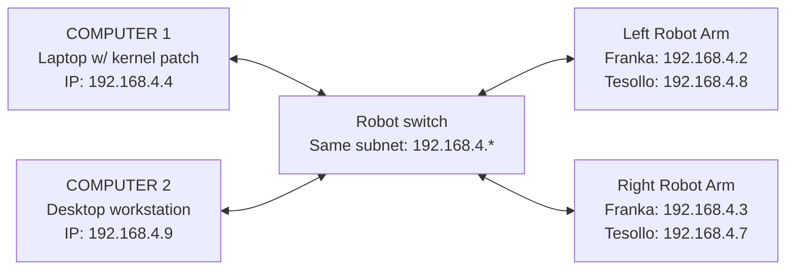

# Bimanual Panda Setup

This document explains how to set up the lab's bimanual Franka Panda robot system from scratch.

The setup includes:

- powering on both robot arms
- checking the Ethernet network configuration
- verifying ROS-related IP settings
- opening the Franka Desk web interface
- unlocking the robot arms
- activating FCI for code control
- understanding emergency stop buttons
- checking end-effector settings when needed


---

## 1. System Overview
The lab setup includes two robot arms, two grippers, one main computers, and network hardware.

### Robot Hardware
- **2 Franka Emika Panda Robots** with the [FCI](https://frankarobotics.github.io/docs/doc/libfranka/docs/getting_started.html) installed.
    - Robot system version: 4.2.X (FER pandas)
    - Robot / Gripper Server version: 5 / 3
- **2 [Tesollo Dg-3F](https://en.tesollo.com/dg-3f-b/) Grippers**. 1 mounted on each Panda

### Computers

- **COMPUTER 1**: Ubuntu Computer (Ubuntu 20.04, 22.04 or 24.04) with [Realtime Kernel Patch Kernel Patch](https://frankarobotics.github.io/docs/doc/libfranka/docs/real_time_kernel.html?highlight=real+time+kernel+patch) installed. 
- **COMPUTER 2** [Optional]: Ubuntu computer (22.04 or 24.04 recommended) with a Nvidia GPU (GeForce RTX 40 or 50 Series recommended).

COMPUTER 2 is required if you want to run anything on a GPU since the kernel patch messes with the Nvidia GPU drivers. Use ROS to send commands between COMPUTER 2 and COMPUTER 1.

### Network
The robots, grippers, and computers all need to be connected to the same ethernet switch via ethernet cables
and **must share the same subnet**.

The system currently uses following subnet:

```text
192.168.4.*
```

For each device, the first three octets of the IP address must stay the same (`192.168.4`) and the last number must be unique. Below is the current network setup. These IP's are what we'll use throughout the rest of the instructions.



---

## 2. Power On the Robot System

### 2.1 Turn on the Pandas

There are two black switches on the two black Panda control boxes under the table. Turn on both switches.

If the power is on but the robot lights don't start turning on:
1. Turn the system off.
2. Wait for 15 minutes.
3. Turn the system on again.

### 2.2 Turn on the Tesollo

There are two transparent boxes on the floor. Turn on switches on both boxes to power on the Tesollos


### 2.3 Check the robot light
The Pandas will flash yellow when starting up. Wait for the lights to turn a solid yellow, which indicate the Pandas are ready to use and their web interface can be accessed.

---

## 3. Computer 1 Network Setup

Computer 1 is the laptop with the real-time kernel patch used to open the Panda web interface.

### 3.1 Open the network settings

Go to `Settings → Network → Wired → gear icon → IPv4`

### 3.2 Required IPv4 settings

Set the robot-facing wired connection as follows:

```text
IPv4 Method: Manual
Address: 192.168.4.4
Netmask: 255.255.255.0
Gateway: leave blank
DNS: Automatic ON
```

The other IPv4 methods should not be selected:

```text
Automatic (DHCP): not selected
Shared to other computers: not selected
Link-Local Only: not selected
Disable: not selected
```


The example configuration uses:

```text
192.168.4.4
```

The first three parts must stay the same:

```text
192.168.4
```

The last number does not have to be exactly `4`, but if it is changed, the corresponding ROS environment values must also be updated.

---

## 4. Computer 2 Network Setup

Computer 2 is the desktop workstation.

### 4.1 Open the network settings

Go to:

```text
Settings → Network
```

Use the robot-facing Ethernet connection. In the current setup, this is the USB Ethernet connection.

Then open:

```text
USB Ethernet → gear icon → IPv4
```

### 4.2 Required IPv4 settings

Set the robot-facing Ethernet connection as follows:

```text
IPv4 Method: Manual
Address: 192.168.4.9
Netmask: 255.255.255.0
Gateway: leave blank
DNS: Automatic ON
Routes: Automatic ON
```

The other IPv4 methods should not be selected:

```text
Automatic (DHCP): not selected
Shared to other computers: not selected
Link-Local Only: not selected
Disable: not selected
```

The example configuration uses:

```text
192.168.4.9
```

The first three parts must stay the same:

```text
192.168.4
```

The last number can be changed if needed, but if it is changed, the corresponding ROS environment values must also be updated.

---

## 5. [OPTIONAL] Set ROS Environment Variables for Discovery

This is required if you are using ROS on multiple computers so that messages are sent properly between computers.

On COMPUTER 1, to set the following variables:
```bash
export ROS_STATIC_PEERS=192.168.4.9
export ROS_AUTOMATIC_DISCOVERY_RANGE=SUBNET
```

The address `192.168.4.9` corresponds to COMPUTER 2, the desktop workstation. If the IP address of COMPUTER 2 changes, this value must be updated.

```bash
export ROS_STATIC_PEERS=192.168.4.4
export ROS_AUTOMATIC_DISCOVERY_RANGE=SUBNET
```
The address `192.168.4.4` corresponds to Computer 1, the browser / interface laptop. If the IP address of Computer 1 changes, this value must be updated.


If you add more computers to the network, you will need to append the new IP addresses to ROS_STATIC_PEERS as shown [here](https://docs.ros.org/en/jazzy/Tutorials/Advanced/Improved-Dynamic-Discovery.html)

---


## 6. Open the Franka Desk Interface

The robot interface can be opened in Chrome through the robot network URL (these don't open correctly in Firefox due to security rules). Open https://192.168.4.2/desk/ for the left panda and https://192.168.4.3/desk/ for right panda.
These are also bookmarked on the laptop in Chrome (Right_Panda, Left_Panda). In chrome, if you see a `Your connection in not private` page, clicked `ADVANCED` and proceed anyway.


## 7. Unlock the Robot Joints

In both Franka desk interfaces, in the right-side control menu, find the **Joints** section.

Click the unlock button on the right side of the Joints row.


This unlocks the robot joints and allows the robot to be moved or controlled.

The lock control is one of the most commonly used buttons in the interface.

---

## 8. Activate FCI for Code Control

For both Franka desk interfaces, click  **Activate FCI** when the robot needs to be controlled through code.


After FCI is active, the interface will show:

```text
FCI is active
Interaction with Desk is disabled while FCI is active.
```

This means code control is enabled.

If you need to manually use Desk again, deactivate FCI first.

---

## 9. Unlock E-stops

There are two kinds of emergency stop buttons for each robot (4 in total). All e-stops need to be released to run code on the robot (you will see yellow line if the estops are released). To release both kinds of e-stops,
```text
Rotate the button clockwise
```

**Yellow emergency stop button**

The yellow emergency stop button is on the floor.

It shuts down power and controls both robot arms together.

This is usually not used unless necessary.

**White emergency stop buttons**

There are two white emergency stop buttons on the floor.

Each one controls one robot arm individually.

When a white emergency stop button is pressed:

```text
Robot light becomes white
```


## 10. Expected Robot Status

After the network, script, interface, and unlock settings are correct:

```text
Robot light: blue
Robot status: ready or code-control ready
```
**If the robot is blue, you are ready to start using code on the robot.**

If the robot is not blue there is an issue. Check the robot status message in the interface or the error message in the terminal and see the `Troubleshooting` section to resolved the issue.


## 11. Quick Checklist

### Power

- [ ] Turn on both black switches on the table legs.
- [ ] Turn on both transparent boxes on the floor.
- [ ] If the robot does not respond, turn off the system, wait 15 minutes, and turn it on again.
- [ ] Confirm the robot light is yellow before using the interface.

### Network

- [ ] Computer 1  is on the `192.168.4.*` subnet.
- [ ] Computer 2 is on the `192.168.4.*` subnet.
- [ ] Computer 2 uses `192.168.4.9` unless the setup has been changed.
- [ ] Computer 1 uses `192.168.4.4` unless the setup has been changed.
- [ ] Netmask is `255.255.255.0`.
- [ ] Gateway is blank.
- [ ] DNS is automatic.

### Scripts
- [ ] Confirm `ROS_STATIC_PEERS=192.168.4.9`.
- [ ] Confirm `ROS_STATIC_PEERS=192.168.4.4`.
- [ ] Make sure script IP values match the computer network settings.

### Interface

- [ ] Open the correct Franka Desk interface page.
- [ ] Unlock the robot from the Joints section.
- [ ] Activate FCI if code control is needed.
- [ ] Check robot status.
- [ ] Confirm the robot light becomes blue.

---

## Troubleshooting

### Robot does not react after power on

Turn the system off, wait 15 minutes, and turn it on again.

### Robot interface cannot be opened

Check:

```text
Computer 1 network address
Robot subnet
Ethernet connection
Robot power
Browser URL
```


### Franka Desktop reports force threshold error or libfranka reports `motion aborted by reflex`

The Pandas play it very safe with regards to joint limits and collisions. If you hit a joint limit or collide with something, the robot will stop and throw an error. 

Franka Desktop errors include:
* force threshold error

Libfranka (code) errors include:
* `libfranka: Move command aborted: motion aborted by reflex! ["cartesian_reflex"]`
* `libfranka: Set Joint Impedance command rejected: command not possible in the current mode ("Reflex")!`


To resolve the error, check whether the robot is blocked, touching something, or in an unsafe configuration. If this is the case, **press both e-stops** and move the robot to a safe configuration using the free-drive mode. To enter free-drive mode, press the 2 buttons on the panda grip by the end-effector ([this video](https://youtu.be/hCfn0mzHLyM?si=U2euvpFYJ82N3g0o) shows you how to do it). Then unlock the e-stops and run your script again. Sometimes just locking and unlocking the e-stops (without moving the robot) will also clear the error.

If the errors don't go away after this, try locking and unlocking the joints in the Franka Desktop interface.


### libfranka reports `Connection to FCI refused.`

Make sure to enable FCI mode on both desk interfaces.

### ROS communication does not work

Check:

```text
Computer 1 IP address
Computer 2 IP address
ROS_AUTOMATIC_DISCOVERY_RANGE=SUBNET
```

### Robot cannot be controlled by code

Check:

```text
FCI is activated
Robot joints are unlocked
Robot status is ready
Robot light is blue
No emergency stop is pressed
```

### Robot light is white

A white emergency stop button may be pressed.

Rotate the corresponding white emergency stop button clockwise to release it.


## End-Effector Settings

If you swap out the end-effector, you need to update the settings.

In the Franka Desk Interface, go to

```text
Settings → End-Effector
```

The mass value is especially important when the hardware configuration changes.


In the current setup, the end-effector page includes a mass setting such as:

```text
Mass: 0.994 kg
```

Only modify this setting when the end-effector or robot hardware configuration changes.

This is especially important if:

- a new robot is added
- a new gripper is installed
- the end-effector changes
- the mass parameter needs to be updated

Do not change the end-effector parameters unless you know the correct mechanical values.

---