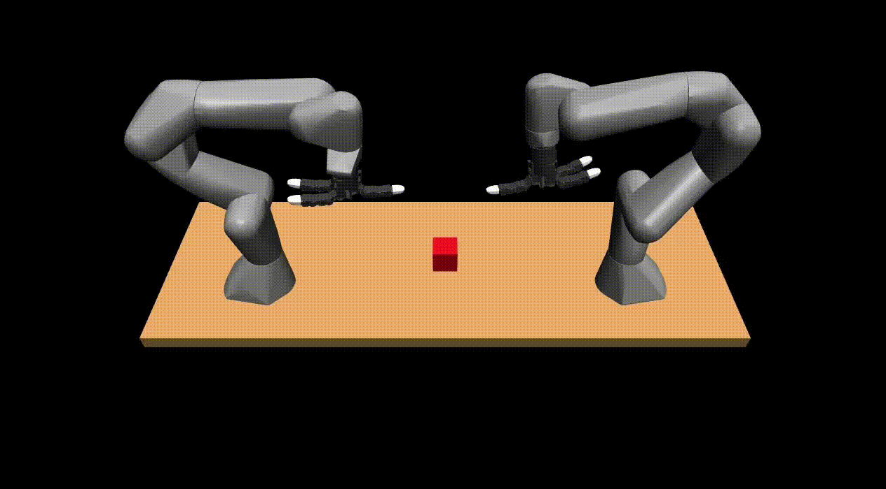

# Tutorial 1: Controlling Panda Bimanual Setup

## 1. Requirements
(a) If you are only running the simulation, you will need Docker Desktop or Docker Engine+Compose. Below are the instructions for each operating system:
* [Mac Instructions](https://docs.docker.com/desktop/setup/install/mac-install/)
    * If you are running into a `Illegal Instruction` error when running the scripts below (common on M3 chip), you will need to disable `Use Rosetta for x86_64/amd64 emulation on Apple Silicon` in Docker Desktop `Settings > Virtual Machine Options`. Note: this will greatly slow down the simulation.
* [Windows Instructions](https://docs.docker.com/desktop/setup/install/windows-install/)
    * When pulling submodules below, if you run into a `filename too long` error, run `git config --global core.longpaths true`.
* Ubuntu Instructions: First, install [Docker Engine](https://docs.docker.com/engine/install/ubuntu/#install-using-the-repository) (recommend using apt). Then [configure docker as a non-root user](https://docs.docker.com/engine/install/linux-postinstall/#manage-docker-as-a-non-root-user). Finally, install [Docker Compose](https://docs.docker.com/compose/install/linux/#install-using-the-repository).

(b) If you are running on the actual hardware, you will need additionally to setup your computer (`COMPUTER 1`) and the robots according to instructions in [instructions/bimanual_system_setup.md](../instructions/bimanual_system_setup.md). Note: this requires your computer be Ubuntu with a realtime kernel patch.

## 2. Setup
Make sure your terminal is in root of this repo (`robot_tutorials`).

First, pull in the submodules:
```bash
git submodule init
git submodule update
```

Next, build docker container. This will take ~6 minutes and ~6.3GB of space.
```bash
docker compose -f docker/compose.bimanual.yaml build
```

After that, start the docker container using **one** of the following:
```bash
# Mac/Windows/Ubuntu
docker compose -f docker/compose.bimanual.yaml run --rm --service-ports bimanual-base

# Ubuntu computer with real-time kernel patch to run code on robot
docker compose -f docker/compose.bimanual.real.yaml run --rm --service-ports bimanual-base
```


## 3. Test your setup in sim
Run the following to test your system in Mujoco. Then go to [http://localhost:8765](http://localhost:8765).
```bash
python3 -m  robot_motion_interface.examples.oscillating_ex --interface mujoco_browser
```

If you see the robot "dancing" in your browser, as shown below, your system is setup correctly. You are ready to move on to the next step. If you're curious what the script that runs this looks like, you can check it out at [libs/robot-stack/robot_motion_interface/src/robot_motion_interface/examples/oscillating_ex.py](../libs/robot-stack/robot_motion_interface/src/robot_motion_interface/examples/oscillating_ex.py).



## 4. Write your own code
Your task to to make the robot move the block. Fill in [tutorial_1.py](tutorial_1.py) to complete the task. In the file are examples of functions you can use. To run the program, you can run:
```bash
python3 tutorial_1/tutorial_1.py --interface sim
```

An example solution is at [tutorial_1_solution.py](tutorial_1_solution.py). 


## 5. Run your code on the robot
You can run the script you executed in sim (note: this has to be on the computer with the kernel patch... see Requirements section a).
```bash
python3 tutorial_1/tutorial_1.py --interface real
```
